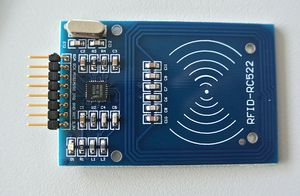

# Python RC522 library
rc522 consists of two Python classes for controlling an SPI RFID module "RC522" using Beaglebone Black.
[MIFARE datasheet](https://www.nxp.com/docs/en/data-sheet/MF1S50YYX_V1.pdf) datasheet.
[MIFAEW Access Bits Calculator](http://calc.gmss.ru/Mifare1k/) Access Bits Calculator.
## Sectors? Blocks?
Classic 1K MIFARE tag has **16 sectors**, each contains **4 blocks**. Each block has 16 bytes. All this stuff is indexed - you must count from zero. The library uses "**block addresses**", which are positions of blocks - so block address 5 is second block of second sector, thus it's block 1 of sector 1 (indexes). Block addresses 0, 1, 2, 3 are from the first sector - sector 0. Block addresses 4, 5, 6, 7 are from the second sector - sector 1, and so on. You should **not write** to first block - S0B0, because it contains manufacturer data. Each sector has it's **sector trailer**, which is located at it's last block - block 3. This block contains keys and access bits for corresponding sector. For more info, look at page 10 of the datasheet.

## Connecting
Connecting RC522 module to SPI is pretty easy. You can use [this neat website](http://beagleboard.org/static/images/cape-headers.png) for reference.

| Board pin name | Board pin | Beaglebone Black pin name |
|----------------|-----------| --------------------------|
| SDA            | 1         | P9\_17, SPI0\_CS0         |
| SCK            | 2         | P9\_22, SPI0\_SCLK        |
| MOSI           | 3         | P9\_18, SPI0\_D1          |
| MISO           | 4         | P9\_21, SPI0\_D0          |
| IRQ            | 5         | P9\_15, GPIO\_48          |
| GND            | 6         | Ground                    |
| RST            | 7         | P9\_23, GPIO\_49          |
| 3.3V           | 8         | VDD\_3V3                  |

